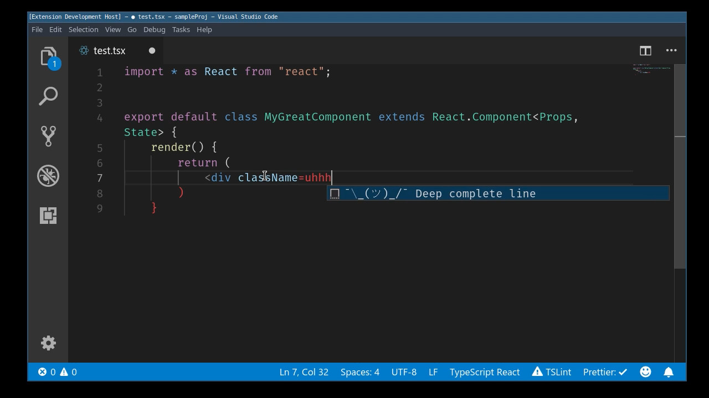

An experimental implementation of IntelliSense for code using a trained recurrent neural network.

Sample 1 (short completions):

[](sample.mp4)


[Sample 2: full file](sample-fullyauto.mp4)

Should work on all kinds of code, but it needs at least ~50MB of code in the target language (more depending on syntax complexity) to be able to learn the syntax.

So far I've only tried it with [TypeScript](http://typescriptlang.org) + React code. This is a pretty hard combination due to at least three different mixed syntax contexts with completely different rules (normal JS, TS Types, and ["HTML"](https://reactjs.org/docs/introducing-jsx.html)).

As is, this isn't good enough to be useful, but it shows that this kind of thing allows completions that would be hard to get otherwise. For example

```ts
import * as React ‸

// auto complete using learned prediction:

import * as React from "react";

// because almost all lines starting with `import * as React` end with `from "react";`

```


## Future Work


### Snippets

Since the net outputs its prediction confidence, it should be possible to automatically create snippets with gaps like

```ts
class ????? extends ????? {
    constructor(????) {
	????
    }
```

by replacing char sequences with low probabilities with gaps.

### Predictions for Repetitive Code

Often you have code that repeats very similar actions for different variables. For example Vectors:

```ts

    var xDist = mapCoordinate(x2) - mapCoordinate(x1);
    var yDist = mapCoordinate(y2) - mapCoordinate(y1);
    var zDist = mapCoordinate(z2) - mapCoordinate(z1);
```

It should be possible to fine tune the model for your own code basis. Then it might be possible for the net to predict the next two lines (`y` and `z`) after you have typed the first one for `x`.


## Setup

1. Find matching open source repositories using GitHub API (output is included in repo)

		yarn install
		yarn run ts-node find.ts > repos.txt
	
    I get publicly available code samples as training data from GitHub using tag search.
2. Clone GitHub repos

		mkdir repos && cd repos
		../clone.sh ../repos.txt
3. Write random prettier config files for data augmentation

		node ./writeconfigs.js

    I format all the code so stuff like indentation and quotes ('' vs "") are consistent.

    But to increase the training data, I use multiple different formatter configurations so the net learns to generalize over formatting.

    I haven't analyzed if this is better than keeping all files as they were.
4. Create input data file by merging all matching files from the cloned repos, formatted with each of the prettier configs
		
		./concat.sh
5. Clean the input data file (allcode.txt) to remove all non-ascii chars for a smaller output layer size 
		
		./clean.sh
6. Get char-rnn-tensorflow https://github.com/phiresky/char-rnn-tensorflow and train the net.

    My fork contains the "sample-stdin.py" script which allows sampling of strings via json IPC over stdin/stdout

    I trained it with this configuration:

    * 3 LSTM layers
    * 256 cells per layer (or try keeping it at 128)
    * 500 chars unrolled sequence length (or try 200)
    * batch size of 300
    * learning rate of 0.002 decaying at 0.99 per epoch


		python train.py --data_dir=./data/typescript-augmented --num_layers 3 --rnn_size 256 --num_epochs 100 --seq_length 500 --batch_size 300 --save_every 100 --decay_rate 0.99 --learning_rate 0.002 --save_dir save-aug-seq1000

    This will take a few hours on a GTX 980 Ti.

7. Open the [vscode-deep-complete](vscode-deep-complete/) directory in VS Code. Then run the extension from the debug panel.


